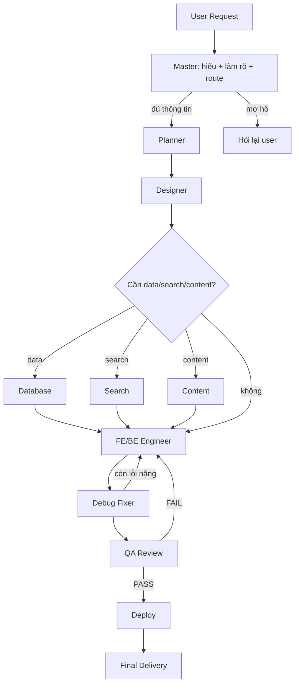

# ARCHITECTURE_REWRITE_PLAN.md — Tái cấu trúc pipeline Daisan.ai thành kiến trúc 12-agent

> **Mục đích:** Kế hoạch kỹ thuật để tái cấu trúc engine sinh code của Daisan.ai (hiện chạy trên VibeSDK) thành **kiến trúc 12-agent** đúng theo `system-prompts/DAISAN_AI_AGENT_WORKFLOW.md`, **mà không phá hệ thống production đang chạy**. Tài liệu này là "bản thiết kế thi công" + sổ đăng ký rủi ro, để đội IT Daisan review và thực hiện theo phase.

---

## 0. Nguyên tắc nền tảng (đọc trước khi làm)

1. **KHÔNG vứt bỏ engine đang chạy.** VibeSDK đã là một pipeline đa-agent thực thụ và đang phục vụ production. Rewrite = **tái-điều-phối (re-orchestrate)** + bổ sung, KHÔNG phải viết lại từ con số 0.
2. **Strangler-fig migration:** dựng pipeline 12-agent mới **chạy song song** sau một feature flag, so sánh chất lượng, rồi mới chuyển dần lưu lượng. Tắt flag = rollback tức thì.
3. **Tái dùng tối đa.** 9/12 vai trò đã tồn tại dưới dạng `operations/*`. Các agent mới **bọc (wrap)** operation cũ thay vì viết lại.
4. **Mỗi agent là một STEP, không phải một Durable Object riêng.** Tạo 12 DO riêng = tốn kém, phức tạp state, không cần thiết. Giữ trong `CodeGeneratorAgent` DO sẵn có; agent = class thực thi một bước.

---

## 1. Hiện trạng: VibeSDK đã có gì (mapping 12-agent ↔ code thật)

| Vai trò (workflow doc) | Component/operation hiện có | Trạng thái |
|---|---|---|
| 🧭 Master Orchestrator | `core/codingAgent.ts` + `core/behaviors/{phasic,agentic}.ts` + Plan/Build mode | ✅ Có |
| 📋 Product Planner | `planning/blueprint.ts` (blueprint = kế hoạch phasic) | ✅ Có |
| 🎨 UI/UX Designer | blueprint `userFlow/uiDesign` + `styleSelection` (lồng trong blueprint) | ⚠️ Lồng, chưa tách |
| ⚛️🔧 FE/BE Engineer | `operations/PhaseImplementation.ts`, `SimpleCodeGeneration.ts`, `assistants/projectsetup.ts` | ✅ Có |
| 📐 Phase Planner | `operations/PhaseGeneration.ts` | ✅ Có |
| 🐞 Debug Fixer | `operations/DeepDebugger.ts`, `PostPhaseCodeFixer.ts`, `assistants/realtimeCodeFixer.ts`, `operations/FileRegeneration.ts` | ✅ Có |
| ✅ QA Review | code review (schema `CodeReviewOutput`) | ⚠️ Một phần |
| 🧹 Refactor | `operations/FileRegeneration.ts` | ⚠️ Một phần |
| 🚀 Deployment | `services/.../DeploymentManager.ts` + deploy pipeline | ✅ Có |
| 🗄️ Database Architect | (chỉ `dataFlow` trong blueprint) | ❌ Thiếu |
| 🔍 Search Engineer | — | ❌ Thiếu |
| ✍️ AI Content / Business Analyst | — (Daisan context chưa nạp) | ❌ Thiếu |

**Điểm inject trung tâm:** `worker/agents/prompts.ts` → `generalSystemPromptBuilder()` (dòng 869) lắp ráp system prompt cho mọi operation. Đây là chỗ nạp **Daisan context** + **role context**.

**Cấu hình model theo agent-action:** `worker/agents/inferutils/config.ts` (`AGENT_CONFIG`) — đã có sẵn key cho từng bước (blueprint, phaseGeneration, firstPhaseImplementation, phaseImplementation, deepDebugger, fileRegeneration...). Pipeline mới tái dùng cơ chế này.

> **Kết luận:** "Rewrite thành 12-agent" thực chất = (a) nạp Daisan context, (b) tách rõ vai trò Designer/QA/Refactor đang lồng, (c) thêm 3 agent thiếu (DB/Search/Content), (d) bọc tất cả trong một **orchestrator tường minh** có handoff contract + loop-back. Tất cả sau một flag.

---

## 2. Kiến trúc đích (target architecture)

### 2.1. Thành phần

```
worker/agents/daisan-pipeline/
├── types.ts            # DaisanAgent, PipelineContext, AgentResult, AgentRole, Handoff
├── context/
│   ├── daisan-context.ts   # Brand + business + UI + code context (cô đọng từ knowledge-base)
│   └── role-prompts.ts     # 12 role prompt (rút từ system-prompts/)
├── agents/
│   ├── master.ts       # Orchestrator: hiểu yêu cầu, route, QA gate
│   ├── planner.ts      # wrap blueprint.ts
│   ├── designer.ts     # tách phần UI/UX khỏi blueprint
│   ├── frontend.ts     # wrap PhaseImplementation (FE)
│   ├── backend.ts      # wrap PhaseImplementation (BE/API)
│   ├── database.ts     # MỚI — thiết kế schema
│   ├── search.ts       # MỚI — ES mapping/facet
│   ├── content.ts      # MỚI — nội dung/SEO
│   ├── debug.ts        # wrap DeepDebugger/PostPhaseCodeFixer
│   ├── qa.ts           # wrap code review + checklist
│   ├── refactor.ts     # wrap FileRegeneration
│   └── deploy.ts       # wrap DeploymentManager
└── orchestrator.ts     # State machine điều phối + handoff + loop-back
```

### 2.2. Hợp đồng agent (interface)

```ts
type AgentRole =
  | 'master' | 'planner' | 'designer'
  | 'frontend' | 'backend' | 'database' | 'search' | 'content'
  | 'debug' | 'qa' | 'refactor' | 'deploy';

interface PipelineContext {
  userRequest: string;
  plan?: ProductPlan;            // từ Planner
  design?: UiSpec;               // từ Designer
  dataModel?: DataModelSpec;     // từ Database (nếu kích hoạt)
  searchSpec?: SearchSpec;       // từ Search (nếu kích hoạt)
  content?: ContentSpec;         // từ Content (nếu kích hoạt)
  files: GeneratedFile[];        // code hiện tại
  issues: Issue[];               // lỗi do Debug/QA phát hiện
  qaVerdict?: 'PASS' | 'FAIL';
  daisanContext: string;         // brand/business/UI/code đã nạp
  history: AgentRunRecord[];     // audit trail từng bước
}

interface DaisanAgent {
  role: AgentRole;
  shouldRun(ctx: PipelineContext): boolean;     // kích hoạt có điều kiện
  run(ctx: PipelineContext): Promise<AgentResult>;
}

interface AgentResult {
  patch: Partial<PipelineContext>;   // cập nhật context
  nextHint?: AgentRole | 'loop' | 'done';
  log: string;
}
```

### 2.3. Luồng điều phối (orchestrator)



**Loop-back rules:**
- QA `FAIL` → quay lại Engineer (tối đa N vòng, sau đó báo Master).
- Debug không sửa được sau K lần → escalate Master → có thể hỏi user.
- Yêu cầu mơ hồ ở Master → dừng, hỏi user (không code).

---

## 3. Migration theo phase (strangler-fig)

| Phase | Nội dung | Chạm production? | Rủi ro |
|---|---|---|---|
| **P0** | Skeleton: `types.ts` + interfaces + orchestrator stub (compile, KHÔNG wire) | Không | ⬇️ Rất thấp |
| **P1** | `daisan-context.ts` + inject vào `generalSystemPromptBuilder` (cũng cải thiện engine hiện tại) | Có (prompt) | ⬇️ Thấp — có thể flag |
| **P2** | Bọc operations cũ thành DaisanAgent (planner/engineer/debug/qa/deploy) + orchestrator, sau flag `DAISAN_PIPELINE` | Có, nhưng sau flag | ⬇️ Thấp (flag off = nguyên trạng) |
| **P3** | 3 agent mới: Database, Search, Content (kích hoạt có điều kiện theo từ khóa yêu cầu) | Sau flag | ⬇️ Thấp |
| **P4** | Tách Designer + QA gate + handoff contract + loop-back tường minh | Sau flag | ⬇️ Trung bình |
| **P5** | Test nội bộ, so sánh chất lượng vs engine cũ, ramp flag 5%→25%→100% | Có (ramp) | ⬇️ Trung bình (ramp + rollback) |

**Thêm behavior type mới:** `'daisan'` bên cạnh `'phasic'|'agentic'` (xem `core/types.ts`). Request có `pipeline: 'daisan'` (hoặc flag bật) → chạy orchestrator mới; ngược lại → engine cũ. Đây là ranh giới strangler-fig.

---

## 4. Sổ đăng ký rủi ro (risk register)

| Rủi ro | Mức | Giảm thiểu |
|---|---|---|
| Phá luồng generate đang chạy | Cao | Toàn bộ sau flag; engine cũ không bị xoá cho tới khi P5 xanh |
| State Durable Object phình to / lệch | Trung bình | PipelineContext gọn, không lưu file lớn vào state core (dùng bảng phụ như conversation) |
| Chi phí token tăng (nhiều agent hơn) | Trung bình | Agent điều kiện (`shouldRun`); tái dùng model preset Fast/Max; cache plan |
| Vòng lặp QA↔Engineer vô hạn | Trung bình | Giới hạn N vòng + escalate Master |
| 3 agent mới (DB/Search/Content) tạo output thừa cho app đơn giản | Thấp | `shouldRun` chỉ kích hoạt theo từ khóa yêu cầu (search/elasticsearch, data model, content/SEO) |
| Khác biệt chất lượng khó đo | Trung bình | P5 chạy A/B nội bộ, dùng deployment-diagnostics + QA verdict làm metric |

**Rollback:** tắt flag `DAISAN_PIPELINE` → 100% lưu lượng về engine cũ ngay lập tức. Không migration DB phá hủy ở các phase P0–P4.

---

## 5. Tiêu chí nghiệm thu từng phase (checklist)

**P0 — Skeleton**
- [ ] `daisan-pipeline/types.ts` compile (typecheck xanh), KHÔNG được import bởi luồng live.
- [ ] Orchestrator stub có chữ ký đầy đủ, throw "not wired" nếu gọi.

**P1 — Daisan context**
- [ ] `daisan-context.ts` ≤ ~2k token, rút từ brand+business+UI+code standard.
- [ ] Inject vào `generalSystemPromptBuilder` qua biến `daisanContext`, có cờ bật/tắt.
- [ ] App generate mới tự đúng brand Daisan (màu cam, ngành gạch) — kiểm chứng bằng 3 prompt mẫu.

**P2 — Orchestrator + wrap**
- [ ] Behavior `'daisan'` chạy được sau flag, đi đủ chuỗi Planner→Engineer→Debug→QA→Deploy.
- [ ] Flag off → 0% thay đổi hành vi (regression test engine cũ xanh).

**P3 — 3 agent mới**
- [ ] DB/Search/Content chỉ chạy khi `shouldRun` đúng; app đơn giản KHÔNG kích hoạt.

**P4 — Designer/QA/handoff**
- [ ] QA trả verdict PASS/FAIL; FAIL loop về Engineer ≤ N vòng.
- [ ] Mỗi handoff ghi `history` (audit trail).

**P5 — Ramp**
- [ ] A/B nội bộ: chất lượng ≥ engine cũ trên 10 prompt mẫu (gồm storefront DaisanStore).
- [ ] Ramp 5%→25%→100%, mỗi mốc theo dõi lỗi build/deploy trước khi tăng.

---

## 6. AI / đội thực hiện PHẢI làm
- Làm theo phase, **mỗi phase sau một flag**, không gộp.
- Tái dùng operation cũ; agent mới chỉ là lớp điều phối + 3 agent nghiệp vụ thiếu.
- Giữ engine cũ sống cho tới khi P5 xanh hoàn toàn.
- Mọi prompt agent tham chiếu knowledge base Daisan.

## 7. AI / đội thực hiện KHÔNG được làm
- KHÔNG xoá/viết đè `codingAgent.ts`, behaviors, operations hiện có khi chưa qua P5.
- KHÔNG tạo 12 Durable Object riêng (agent = step, không phải DO).
- KHÔNG bật pipeline mới cho 100% lưu lượng trước khi A/B xanh.
- KHÔNG nhồi toàn bộ knowledge base (218KB) vào prompt — chỉ context cô đọng.
- KHÔNG để vòng lặp QA↔Engineer không giới hạn.

---

## 8. Bước kế tiếp đề xuất
1. **P0 + P1 ngay** (rủi ro thấp, giá trị cao): skeleton interfaces + Daisan context injection — cũng nâng chất lượng engine hiện tại tức thì.
2. Review kết quả P1 (3 prompt mẫu) → quyết định tiếp P2 (orchestrator sau flag).

> Đây là cách "rewrite thành 12-agent" **đúng kỹ thuật**: tường minh hóa kiến trúc 12-agent trên nền engine đã proven, qua strangler-fig, đo lường rồi mới chuyển lưu lượng — thay vì rip-out rủi ro.
