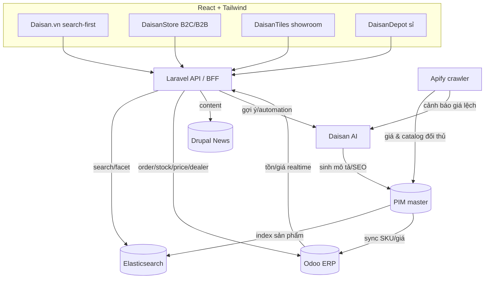

# DAISAN_BUSINESS_CONTEXT.md — Bối cảnh nghiệp vụ Daisan

> **Mục đích tài liệu:** Cung cấp cho **Daisan.ai** (nền tảng AI hỗ trợ code chuyên nghiệp) toàn bộ bối cảnh nghiệp vụ của hệ sinh thái Daisan, để mọi tính năng sinh code, lập kế hoạch, chia component, đề xuất cải tiến đều bám sát mô hình kinh doanh thật. Đây là "nguồn sự thật" (single source of truth) về domain: mô hình kinh doanh, các luồng nghiệp vụ chính (B2C/B2B, RFQ, bán lẻ gạch, bán sỉ, search-first, ads, AI vận hành, PIM) và kiến trúc tích hợp (Odoo, Elasticsearch, Drupal, Apify, Laravel). Khi AI sinh code cho bất kỳ module nào, AI **bắt buộc** tham chiếu tài liệu này để dùng đúng thuật ngữ, đúng thực thể dữ liệu, đúng luồng và đúng tông thương hiệu (CAM Daisan).

---

## 1. Tổng quan mô hình kinh doanh Daisan

Daisan là **hệ sinh thái thương mại chuyên ngành vật liệu xây dựng (VLXD)** — trọng tâm là **gạch ốp lát, đá, thiết bị vệ sinh, vật liệu hoàn thiện** — kết hợp giữa **bán lẻ showroom**, **phân phối sỉ**, **thương mại điện tử B2C/B2B**, **tìm kiếm sản phẩm (search-first)**, **quảng cáo** và **tự động hóa bằng AI**. Mô hình lai giữa "marketplace + chuỗi bán lẻ + trung tâm phân phối", phục vụ ba nhóm khách chính: **người dùng cuối (chủ nhà/đang xây sửa)**, **nhà thầu/kiến trúc sư/đại lý (dealer)**, và **doanh nghiệp mua sỉ**.

### 1.1. Bản đồ các hệ thống

| Hệ thống | Vai trò nghiệp vụ | Nhóm khách chính | Đặc thù kỹ thuật |
|---|---|---|---|
| **Daisan.vn** | Cổng tìm kiếm sản phẩm/VLXD/nhà cung cấp + catalog (search-first) | Người dùng cuối, nhà thầu, KTS | Elasticsearch facet, SEO, tốc độ |
| **DaisanStore** | Sàn TMĐT B2C/B2B (mua hàng, giỏ hàng, thanh toán, RFQ) | B2C + B2B | Cart, checkout, payment, đơn hàng |
| **DaisanTiles** | Chuỗi bán lẻ gạch (showroom, tồn kho trưng bày, tư vấn) | Khách lẻ tại showroom | Quản lý showroom, mẫu trưng bày |
| **DaisanDepot** | Trung tâm phân phối giá sỉ (bậc giá, đơn lớn) | Đại lý, nhà thầu, DN | Bậc giá theo SL, hợp đồng |
| **Daisan AI** | Nền tảng AI hỗ trợ vận hành/code/quản trị sản phẩm/bán hàng | Đội IT, vận hành | LLM, automation, agent |
| **Daisan Ads** | Nền tảng quảng cáo nội bộ/đối tác (sponsored, banner) | Nhà cung cấp, brand | Đấu giá vị trí, tracking |
| **B2B.daisan.vn** | Nền tảng thương mại B2B (giá theo hợp đồng, công nợ) | Đại lý/DN ký hợp đồng | Phê duyệt, hạn mức công nợ |
| **News.daisan.vn** | Tin tức/nội dung/SEO (xu hướng, hướng dẫn chọn gạch) | Toàn bộ người dùng | Drupal CMS, content marketing |

### 1.2. Chuỗi giá trị (value chain)

```
Nhà cung cấp/Hãng gạch ──► Nhập kho (Odoo ERP) ──► PIM chuẩn hóa dữ liệu sản phẩm
        │                                                      │
        ▼                                                      ▼
 Apify (crawl đối thủ/catalog)                      Elasticsearch (index search/facet)
        │                                                      │
        └──────────────► Daisan.vn / DaisanStore / Tiles / Depot ◄── Daisan AI (gợi ý, automation)
                                       │
                                       ▼
                        Đơn hàng/RFQ ──► Odoo (đơn, tồn, công nợ, giao hàng)
```

### 1.3. Nguyên tắc thương hiệu khi sinh UI

- Màu chủ đạo **CAM Daisan** (đỏ cam thương mại) cho CTA chính (Mua, Báo giá, Thêm vào giỏ), màu phụ **xám trung tính** cho nền/khung và **xanh** cho trạng thái thông tin/thành công.
- Stack frontend mặc định: **React + Tailwind**; backend: **Laravel + API**; search: **Elasticsearch**; ERP: **Odoo**; CMS/news: **Drupal**; crawl: **Apify**.

```js
// tailwind.config.js — tokens màu thương hiệu Daisan (AI dùng làm chuẩn)
module.exports = {
  theme: {
    extend: {
      colors: {
        daisan: {
          DEFAULT: '#E8521E', // CAM Daisan — CTA chính
          dark:    '#C53F12',
          light:   '#FFF1EC',
        },
        neutral: { 500: '#6B7280', 100: '#F3F4F6' }, // xám phụ
        info:    '#1E73E8', // xanh trạng thái
      },
    },
  },
};
```

---

## 2. Marketplace B2C/B2B (luồng mua, RFQ báo giá, giỏ hàng)

DaisanStore và B2B.daisan.vn là hai mặt của sàn thương mại. **B2C** tối ưu cho mua nhanh, giá niêm yết, giỏ hàng và thanh toán online. **B2B** tối ưu cho **RFQ (Request For Quotation — yêu cầu báo giá)**, giá theo hợp đồng/đại lý, hạn mức công nợ và phê duyệt.

### 2.1. Luồng mua hàng B2C (giỏ hàng → đặt hàng)

```
Tìm/Duyệt sản phẩm ─► Xem chi tiết (PDP) ─► Thêm vào giỏ ─► Giỏ hàng
   └─► Áp mã/khuyến mãi ─► Checkout (địa chỉ, vận chuyển) ─► Thanh toán
        └─► Tạo đơn (Order) ─► Đồng bộ Odoo (trừ tồn, lập phiếu) ─► Theo dõi giao hàng
```

Đặc thù VLXD ở luồng B2C: sản phẩm bán theo **đơn vị quy đổi** (viên / m² / hộp / pallet), nên giỏ hàng phải xử lý quy đổi (ví dụ: gạch 60×60 bán theo m², 1 hộp = 1.44 m² = 4 viên). Phí vận chuyển phụ thuộc **khối lượng/thể tích** (gạch nặng), thường tính riêng và có thể "liên hệ báo giá vận chuyển".

### 2.2. Luồng RFQ báo giá (B2B)

RFQ là trục chính của B2B trong ngành VLXD vì đơn lớn, giá thương lượng, cần bóc tách số lượng theo hạng mục công trình.

```
KH (nhà thầu/đại lý) tạo RFQ:
  - Chọn nhiều sản phẩm + số lượng dự kiến (có thể tải file BOQ/danh mục)
  - Ghi chú yêu cầu (tiến độ, địa điểm công trình, điều kiện thanh toán)
        │
        ▼
Hệ thống gán RFQ ─► Sales/Trợ lý AI tổng hợp ─► Lập báo giá (Quotation)
  - Tính bậc giá theo SL, chiết khấu đại lý, phí vận chuyển
        │
        ▼
Gửi báo giá ─► KH phản hồi (chấp nhận / thương lượng vòng tiếp)
        │
        ▼
Chốt ─► Chuyển thành Sales Order ─► Đồng bộ Odoo (đặt cọc, lịch giao, công nợ)
```

Trạng thái RFQ chuẩn: `draft → submitted → quoted → negotiating → accepted → converted_to_order → rejected/expired`.

### 2.3. Giỏ hàng — yêu cầu kỹ thuật

- Giỏ hàng hỗ trợ cả "mua ngay" (B2C) và "thêm vào RFQ" (B2B) — cùng UI, khác hành vi checkout.
- Lưu giỏ theo session + đồng bộ vào tài khoản khi đăng nhập; giữ giá tại thời điểm thêm nhưng **xác nhận lại giá khi checkout** (giá VLXD biến động).

```tsx
// Ví dụ React — nút hành động kép trên PDP (B2C vs B2B)
function PdpActions({ product, isB2B }: { product: Product; isB2B: boolean }) {
  return (
    <div className="flex gap-3">
      <button className="bg-daisan hover:bg-daisan-dark text-white font-semibold px-5 py-3 rounded-lg">
        {isB2B ? 'Thêm vào yêu cầu báo giá' : 'Thêm vào giỏ'}
      </button>
      {isB2B && (
        <button className="border border-daisan text-daisan px-5 py-3 rounded-lg">
          Gửi RFQ nhanh
        </button>
      )}
    </div>
  );
}
```

```http
### Ví dụ API (Laravel) — tạo RFQ
POST /api/v1/rfq
Authorization: Bearer <token>
Content-Type: application/json

{
  "items": [
    { "sku": "GR-6060-MATTE-001", "qty": 320, "unit": "m2" },
    { "sku": "KEO-DAN-25KG", "qty": 40, "unit": "bao" }
  ],
  "project": { "name": "Chung cư An Phú", "location": "Quận 2, HCM" },
  "note": "Cần báo giá kèm phí vận chuyển, giao theo 3 đợt",
  "payment_terms": "30% cọc, 70% trước giao"
}
```

### Checklist phần Marketplace
- [ ] Phân biệt rõ luồng B2C (cart→checkout) và B2B (RFQ→quotation→order).
- [ ] Hỗ trợ đơn vị quy đổi viên/m²/hộp/pallet trong giỏ và báo giá.
- [ ] Trạng thái RFQ đầy đủ và đồng bộ Order sang Odoo khi chốt.
- [ ] Xác nhận lại giá khi checkout, cảnh báo khi giá đã thay đổi.
- [ ] Hỗ trợ tải file BOQ/danh mục khi tạo RFQ.

---

## 3. Bán lẻ gạch DaisanTiles (showroom, tồn kho trưng bày)

DaisanTiles là chuỗi **showroom bán lẻ gạch** — nơi khách xem mẫu thật, sờ bề mặt, phối không gian trước khi mua. Nghiệp vụ trọng tâm: **quản lý showroom**, **tồn kho trưng bày (mẫu)** tách biệt với **tồn kho bán**, và **tư vấn tại điểm**.

### 3.1. Đặc thù nghiệp vụ

- Mỗi showroom có **danh mục mẫu trưng bày** (display inventory): mẫu gạch gắn trên bảng/sàn mẫu, không bán nhưng cần biết "showroom nào đang có mẫu X" để điều hướng khách.
- **Tồn kho bán** lấy theo kho khu vực (Odoo), khác với tồn trưng bày.
- Hỗ trợ **đặt giữ hàng tại showroom** (reserve), **xuất mẫu/đặt theo lô**, lịch hẹn tư vấn.
- "Có mặt tại showroom gần bạn" — tính năng tìm showroom theo vị trí + lọc theo sản phẩm đang trưng bày.

### 3.2. Luồng tại showroom

```
Khách đến showroom / xem online "có tại showroom nào"
   ─► Tư vấn viên tra cứu mẫu trưng bày + tồn bán khu vực
   ─► Phối cảnh/gợi ý không gian (AI gợi ý mẫu cùng tông)
   ─► Khách chốt ─► Tạo đơn POS/Order ─► Trừ tồn bán (Odoo) ─► Giao/Lấy tại kho
```

### 3.3. Yêu cầu dữ liệu showroom

```http
### Tìm showroom đang trưng bày một sản phẩm
GET /api/v1/showrooms?display_sku=GR-6060-MATTE-001&near=10.78,106.70&radius_km=15
```

```json
{
  "showrooms": [
    {
      "id": "SR-HCM-Q7",
      "name": "DaisanTiles Quận 7",
      "address": "...",
      "distance_km": 4.2,
      "has_display": true,
      "sellable_stock_region": 1820.5,
      "unit": "m2"
    }
  ]
}
```

### Checklist phần DaisanTiles
- [ ] Tách biệt tồn trưng bày (display) và tồn bán (sellable).
- [ ] Tìm showroom theo vị trí + sản phẩm đang trưng bày.
- [ ] Hỗ trợ đặt giữ hàng (reserve) và đặt lịch tư vấn.
- [ ] Đồng bộ đơn POS showroom về Odoo (trừ tồn bán đúng kho).

---

## 4. Bán sỉ DaisanDepot (giá sỉ, bậc giá, đặt số lượng lớn)

DaisanDepot là **trung tâm phân phối giá sỉ** cho đại lý/nhà thầu/DN mua lượng lớn. Trục nghiệp vụ: **bậc giá theo số lượng (price tiers)**, **giá đại lý/hợp đồng**, **đơn hàng lớn theo pallet/container**, **công nợ**.

### 4.1. Bậc giá (price tiers)

Giá giảm dần theo khối lượng mua. Mỗi sản phẩm có bảng bậc giá; có thể chồng thêm **chiết khấu nhóm đại lý** (dealer tier: bạc/vàng/kim cương).

| Bậc | Số lượng (m²) | Đơn giá (VND/m²) | Ghi chú |
|---|---|---|---|
| Lẻ | < 50 | 285.000 | Giá niêm yết |
| Sỉ 1 | 50 – 199 | 262.000 | -8% |
| Sỉ 2 | 200 – 499 | 248.000 | -13% |
| Sỉ 3 | ≥ 500 | 235.000 | -17.5%, theo pallet |

Giá cuối = `tier_price(qty) × (1 − dealer_discount) − contract_adjustment`.

### 4.2. Luồng đặt sỉ

```
Đại lý đăng nhập (đã duyệt hạn mức) ─► Chọn sản phẩm + nhập SL lớn
   ─► Hệ thống tính bậc giá realtime + chiết khấu đại lý
   ─► Tạo đơn sỉ / hoặc RFQ nếu vượt ngưỡng cần duyệt
   ─► Phê duyệt (hạn mức công nợ) ─► Sales Order (Odoo) ─► Lịch giao theo đợt
```

```tsx
// Ví dụ hiển thị bậc giá realtime theo số lượng nhập
function TierPrice({ tiers, qty }: { tiers: PriceTier[]; qty: number }) {
  const active = tiers.find(t => qty >= t.min && (t.max == null || qty <= t.max));
  return (
    <div className="rounded-lg bg-daisan-light p-3 text-sm">
      <span className="text-neutral-500">Đơn giá áp dụng cho {qty} m²: </span>
      <span className="text-daisan font-bold text-lg">
        {active ? active.price.toLocaleString('vi-VN') : '—'} đ/m²
      </span>
    </div>
  );
}
```

### Checklist phần DaisanDepot
- [ ] Bảng bậc giá theo SL + chiết khấu nhóm đại lý (chồng nhiều lớp).
- [ ] Tính giá realtime khi đại lý nhập số lượng.
- [ ] Phê duyệt đơn vượt ngưỡng + kiểm tra hạn mức công nợ.
- [ ] Hỗ trợ giao theo đợt (split delivery) và đơn vị pallet/container.

---

## 5. Tìm kiếm sản phẩm (Daisan.vn — search-first)

Daisan.vn theo triết lý **search-first**: tìm kiếm là cửa ngõ chính, nhanh, gợi ý thông minh, **facet (lọc đa chiều)** đặc thù VLXD. Powered by **Elasticsearch**.

### 5.1. Facet đặc thù gạch/VLXD

| Facet | Ví dụ giá trị |
|---|---|
| **Kích thước** | 30×30, 60×60, 80×80, 60×120, 15×90 (cm) |
| **Màu sắc** | Trắng, vân đá, xám, be, đen, vàng |
| **Bề mặt** | Bóng (polished), mờ (matte), nhám (anti-slip), sần |
| **Không gian** | Phòng khách, bếp, WC, sân, ngoại thất, mặt tiền |
| **Thương hiệu** | Theo hãng/nhà cung cấp |
| **Chất liệu** | Porcelain, ceramic, granite, đá tự nhiên |
| **Khoảng giá** | Theo m² |

### 5.2. Yêu cầu trải nghiệm tìm kiếm

- Autocomplete + gợi ý (typo-tolerant tiếng Việt có/không dấu), tìm theo mã SKU, theo thuộc tính ("gạch 60x60 vân đá lát phòng khách").
- Lọc facet không reload trang, đếm số kết quả mỗi giá trị facet, sắp xếp (giá, mới, bán chạy, liên quan).
- SEO: trang facet có URL thân thiện, có thể index (`/gach-op-lat/60x60/van-da`).

```json
// Ví dụ Elasticsearch query — tìm + facet
{
  "query": {
    "bool": {
      "must": [{ "multi_match": { "query": "gạch 60x60 vân đá", "fields": ["name^3","attrs.*","brand"] }}],
      "filter": [
        { "term": { "size": "60x60" } },
        { "terms": { "space": ["phong-khach"] } }
      ]
    }
  },
  "aggs": {
    "by_surface": { "terms": { "field": "surface" } },
    "by_color":   { "terms": { "field": "color" } },
    "price_ranges":{ "range": { "field": "price_per_m2", "ranges": [{"to":200000},{"from":200000,"to":300000},{"from":300000}] } }
  }
}
```

### Checklist phần Search
- [ ] Facet đầy đủ: kích thước/màu/bề mặt/không gian/thương hiệu/chất liệu/giá.
- [ ] Autocomplete typo-tolerant tiếng Việt (có/không dấu) + tìm theo SKU.
- [ ] Đếm số kết quả theo facet, lọc không reload, nhiều kiểu sắp xếp.
- [ ] URL facet thân thiện SEO + index được.

---

## 6. Quảng cáo Daisan Ads

Daisan Ads cho phép **nhà cung cấp/brand** mua vị trí hiển thị: **sponsored products** (đẩy lên đầu kết quả tìm kiếm/danh mục), **banner** (trang chủ/danh mục/PDP), **gợi ý tài trợ**.

### 6.1. Nghiệp vụ

- Loại quảng cáo: `sponsored_search`, `category_banner`, `homepage_banner`, `pdp_related_sponsored`.
- Mô hình tính phí: CPC (cost-per-click) cho sponsored search, CPM/flat cho banner.
- Đấu giá vị trí theo từ khóa/danh mục + điểm liên quan; gắn nhãn rõ "Tài trợ".
- Tracking: impression, click, CTR, chuyển đổi; báo cáo cho nhà cung cấp.

```tsx
// Thẻ sản phẩm tài trợ phải gắn nhãn rõ ràng
<span className="text-xs text-neutral-500 border border-neutral-100 px-1.5 py-0.5 rounded">
  Tài trợ
</span>
```

### Checklist phần Ads
- [ ] Phân loại ad slot rõ ràng + nhãn "Tài trợ" bắt buộc.
- [ ] Tracking impression/click/CTR/chuyển đổi, không làm chậm trang.
- [ ] Tách logic ranking organic và sponsored, minh bạch.

---

## 7. AI vận hành (tự động hóa quy trình)

Daisan AI hỗ trợ **vận hành nội bộ + trải nghiệm khách**: tự động hóa quy trình lặp, hỗ trợ ra quyết định.

| Lĩnh vực | Ứng dụng AI cụ thể |
|---|---|
| **PIM** | Tự sinh mô tả/SEO sản phẩm, chuẩn hóa thuộc tính, gắn thẻ không gian, dịch nội dung |
| **Search** | Hiểu truy vấn ngôn ngữ tự nhiên tiếng Việt, gợi ý "tìm tương tự", phối cảnh |
| **Bán hàng** | Trợ lý RFQ (gợi ý báo giá), upsell/cross-sell (keo, ron, phụ kiện theo gạch) |
| **Vận hành** | Cảnh báo tồn thấp/đặt lại hàng, phát hiện giá lệch đối thủ (từ Apify), dự báo nhu cầu |
| **Code/IT** | Daisan.ai sinh code, chia component, sửa lỗi, preview UI (chính nền tảng này) |
| **CSKH** | Chatbot tư vấn chọn gạch theo không gian/ngân sách |

### Checklist phần AI vận hành
- [ ] Mọi tự động hóa có "người duyệt" cho hành động ảnh hưởng giá/đơn/tồn.
- [ ] AI gợi ý dựa trên dữ liệu thật (PIM, Odoo, Apify), không bịa thông số.
- [ ] Log lại đề xuất AI để truy vết/đánh giá.

---

## 8. Quản lý sản phẩm — PIM (Product Information Management)

PIM là **trung tâm dữ liệu sản phẩm** — chuẩn hóa thông tin trước khi đẩy ra Daisan.vn/Store/Tiles/Depot và index Elasticsearch.

### 8.1. Thành phần PIM

- **Product**: SKU, tên, mô tả, đơn vị bán + quy đổi (viên/m²/hộp/pallet), trạng thái publish.
- **Attribute**: thuộc tính chuẩn hóa (kích thước, màu, bề mặt, chất liệu, không gian, độ chống trượt, hệ số hút nước...). Dùng từ điển giá trị chuẩn (controlled vocabulary) để facet sạch.
- **Category**: cây danh mục (gạch ốp lát → theo kích thước/không gian/chất liệu), mapping nhiều kênh.
- **Media**: ảnh sản phẩm, ảnh phối cảnh không gian, ảnh bề mặt zoom, video; quy chuẩn kích thước/alt.
- **SEO**: title, meta, slug, schema.org Product, từ khóa.
- **Publish rules**: điều kiện được publish (đủ ảnh, đủ thuộc tính bắt buộc, có giá, có tồn) cho từng kênh.

### 8.2. Quy tắc publish (ví dụ)

```
Publish lên Daisan.vn khi:
  ✓ Có ≥ 3 ảnh (1 mặt sản phẩm, 1 phối cảnh, 1 bề mặt)
  ✓ Đủ thuộc tính bắt buộc: kích thước, màu, bề mặt, không gian, chất liệu
  ✓ Có SEO title + slug + meta
  ✓ Có giá niêm yết và đơn vị quy đổi
Publish lên Depot khi: thêm điều kiện có bảng bậc giá sỉ.
```

### Checklist phần PIM
- [ ] Từ điển giá trị chuẩn cho mọi thuộc tính facet (vocabulary).
- [ ] Quy tắc publish theo kênh, chặn publish khi thiếu dữ liệu bắt buộc.
- [ ] Media có alt/SEO; đơn vị bán + quy đổi đầy đủ.
- [ ] Đồng bộ PIM → Elasticsearch sau mỗi thay đổi.

---

## 9. Kiến trúc tích hợp (Odoo, Elasticsearch, Drupal, Apify, Laravel)

### 9.1. Vai trò từng hệ thống

| Hệ thống | Vai trò | Là nguồn sự thật của |
|---|---|---|
| **Laravel + API** | Backend trung tâm, BFF/API gateway, orchestration nghiệp vụ, xác thực, giỏ/RFQ/đơn | Logic nghiệp vụ, phiên người dùng |
| **Odoo (ERP)** | Đơn hàng, tồn kho, công nợ, giao hàng, mua hàng, kế toán | Order, Inventory, Pricing gốc, Dealer |
| **Elasticsearch** | Tìm kiếm + facet + autocomplete | Index tìm kiếm (read-optimized) |
| **Drupal (CMS)** | News.daisan.vn — tin tức, hướng dẫn, SEO content | Nội dung biên tập |
| **Apify** | Crawl/scrape catalog & giá đối thủ, làm giàu dữ liệu | Dữ liệu thị trường (đối thủ) |
| **PIM** | Chuẩn hóa thông tin sản phẩm | Product master data |

### 9.2. Sơ đồ luồng dữ liệu (Mermaid)



### 9.3. Luồng dữ liệu chính (mô tả)

1. **Tạo/cập nhật sản phẩm:** PIM chuẩn hóa → đẩy **index sang Elasticsearch** (cho search) và **sync SKU/giá gốc sang Odoo** (cho bán/tồn).
2. **Tìm kiếm:** Frontend → Laravel API → **Elasticsearch** trả kết quả + facet; tồn/giá realtime lấy bổ sung từ **Odoo** khi vào PDP/checkout.
3. **Đặt hàng/RFQ:** Frontend → Laravel API tạo Order/RFQ → chốt thì **đồng bộ Odoo** (trừ tồn, lập phiếu, công nợ, lịch giao).
4. **Nội dung:** News.daisan.vn quản trị trên **Drupal**, frontend đọc qua API; nội dung hỗ trợ SEO/điều hướng sản phẩm.
5. **Thị trường:** **Apify** crawl giá/catalog đối thủ → làm giàu PIM + cấp dữ liệu cho **Daisan AI** cảnh báo giá lệch, gợi ý điều chỉnh.
6. **AI:** sinh mô tả/SEO cho PIM, hiểu truy vấn cho Search, hỗ trợ RFQ cho Sales — mọi hành động ảnh hưởng giá/đơn đều qua người duyệt.

### 9.4. Nguyên tắc tích hợp (cho AI sinh code)

- **Odoo là nguồn sự thật về tồn/giá gốc/đơn/công nợ** — không tự ý ghi đè ở Laravel; Laravel orchestrate và đồng bộ.
- **Elasticsearch là read model** — không dùng làm nguồn sự thật; mọi thay đổi đi từ PIM/Odoo rồi reindex.
- Giao tiếp qua **API có version** (`/api/v1/...`), idempotent cho thao tác đơn/đồng bộ.
- Dữ liệu đối thủ (Apify) chỉ để tham khảo/cảnh báo, **không hiển thị trực tiếp** như sản phẩm Daisan.

---

## 10. Bảng các thực thể dữ liệu chính

| Thực thể | Mô tả | Thuộc tính then chốt | Nguồn sự thật | Quan hệ |
|---|---|---|---|---|
| **Product** | Sản phẩm/SKU VLXD | sku, name, attrs (size/color/surface/space/material), unit + conversions, price, media, seo, status | PIM (master), Odoo (giá/tồn) | thuộc Category; có nhiều PriceTier; trưng bày tại Showroom |
| **Category** | Danh mục cây | id, parent_id, name, slug, channel_mapping | PIM | có nhiều Product |
| **Showroom** | Điểm bán DaisanTiles | id, name, address, geo, display_inventory, sellable_stock_region | Odoo (tồn bán) + PIM (mẫu) | trưng bày nhiều Product |
| **Dealer** | Đại lý/khách B2B | id, name, tier (bạc/vàng/kim cương), credit_limit, discount_rules, status | Odoo | tạo RFQ/Order; có PriceTier riêng |
| **RFQ** | Yêu cầu báo giá B2B | id, dealer_id, items[], project, note, status, quotation | Laravel | gồm nhiều Product; chuyển thành Order |
| **Order** | Đơn hàng | id, type (b2c/b2b/pos), items[], pricing, delivery, payment, status | Odoo | từ Cart/RFQ; thuộc Dealer (nếu B2B) |
| **PriceTier** | Bậc giá sỉ | product_id, min_qty, max_qty, price, unit | PIM/Odoo | thuộc Product |
| **Attribute** | Thuộc tính chuẩn hóa | code, label, type, vocabulary[] | PIM | gắn vào Product; tạo facet ES |
| **AdCampaign** | Chiến dịch quảng cáo | id, supplier_id, type, targeting, bid, budget, metrics | Laravel | quảng bá Product |

---

## 11. AI PHẢI LÀM

- **AI PHẢI** dùng đúng tên hệ thống và thuật ngữ Daisan (Daisan.vn, DaisanStore, DaisanTiles, DaisanDepot, Daisan Ads, B2B.daisan.vn, News.daisan.vn) khi sinh code/UI/đặt tên module.
- **AI PHẢI** phân biệt rõ luồng **B2C (cart→checkout)** và **B2B (RFQ→quotation→order)** khi sinh tính năng thương mại.
- **AI PHẢI** xử lý **đơn vị quy đổi** VLXD (viên/m²/hộp/pallet) trong mọi tính toán giỏ hàng, báo giá, bậc giá.
- **AI PHẢI** dùng **Elasticsearch facet** đặc thù (kích thước/màu/bề mặt/không gian/thương hiệu/chất liệu/giá) khi sinh tính năng tìm kiếm.
- **AI PHẢI** coi **Odoo là nguồn sự thật** về tồn/giá gốc/đơn/công nợ và đồng bộ qua API Laravel có version, idempotent.
- **AI PHẢI** coi **Elasticsearch là read model**, mọi thay đổi đi từ PIM/Odoo rồi reindex.
- **AI PHẢI** áp dụng **màu CAM Daisan** cho CTA chính và token Tailwind chuẩn trong tài liệu này.
- **AI PHẢI** tôn trọng **publish rules của PIM** (đủ ảnh/thuộc tính/SEO/giá) khi sinh logic hiển thị sản phẩm.
- **AI PHẢI** gắn nhãn **"Tài trợ"** rõ ràng cho mọi nội dung quảng cáo Daisan Ads.
- **AI PHẢI** đưa **"người duyệt"** vào mọi hành động AI ảnh hưởng giá/đơn/tồn.
- **AI PHẢI** dùng stack chuẩn: React + Tailwind, Laravel + API, Elasticsearch, Odoo, Drupal, Apify.

## 12. AI KHÔNG ĐƯỢC LÀM

- **AI KHÔNG** trộn lẫn luồng B2C và B2B (ví dụ: cho B2B checkout thẳng bỏ qua RFQ/phê duyệt khi nghiệp vụ yêu cầu báo giá).
- **AI KHÔNG** ghi đè trực tiếp tồn/giá/đơn trong Odoo từ Laravel ngoài luồng đồng bộ chính thức.
- **AI KHÔNG** dùng Elasticsearch làm nguồn sự thật để ghi dữ liệu nghiệp vụ.
- **AI KHÔNG** bỏ qua đơn vị quy đổi (tính theo "cái" cho gạch bán theo m²) gây sai giá/sai tồn.
- **AI KHÔNG** hiển thị dữ liệu đối thủ crawl từ Apify như sản phẩm/giá chính thức của Daisan.
- **AI KHÔNG** publish sản phẩm thiếu dữ liệu bắt buộc theo publish rules của PIM.
- **AI KHÔNG** trộn kết quả organic và sponsored mà không gắn nhãn minh bạch.
- **AI KHÔNG** tự bịa thông số kỹ thuật/giá sản phẩm; phải lấy từ PIM/Odoo.
- **AI KHÔNG** tự động thực thi hành động ảnh hưởng giá/đơn/tồn mà không có bước người duyệt.
- **AI KHÔNG** dùng màu/branding lệch chuẩn (CTA không phải CAM Daisan) hoặc đặt tên module sai hệ thống.

---

## 13. Checklist tổng hợp áp dụng cho mọi tính năng sinh ra

- [ ] Xác định module thuộc hệ thống nào (Daisan.vn/Store/Tiles/Depot/Ads/B2B/News) và dùng đúng thuật ngữ.
- [ ] Xác định khách hàng mục tiêu (B2C / B2B / dealer) và chọn đúng luồng (cart vs RFQ).
- [ ] Xử lý đơn vị quy đổi và bậc giá nếu liên quan bán hàng.
- [ ] Tìm kiếm dùng Elasticsearch + facet chuẩn; ghi dữ liệu qua PIM/Odoo, không ghi thẳng ES.
- [ ] Đồng bộ Odoo cho tồn/giá/đơn/công nợ; API có version + idempotent.
- [ ] Tôn trọng publish rules PIM và gắn nhãn quảng cáo.
- [ ] Áp token màu CAM Daisan + stack React/Tailwind/Laravel.
- [ ] Có bước người duyệt cho hành động AI nhạy cảm; log lại đề xuất.
