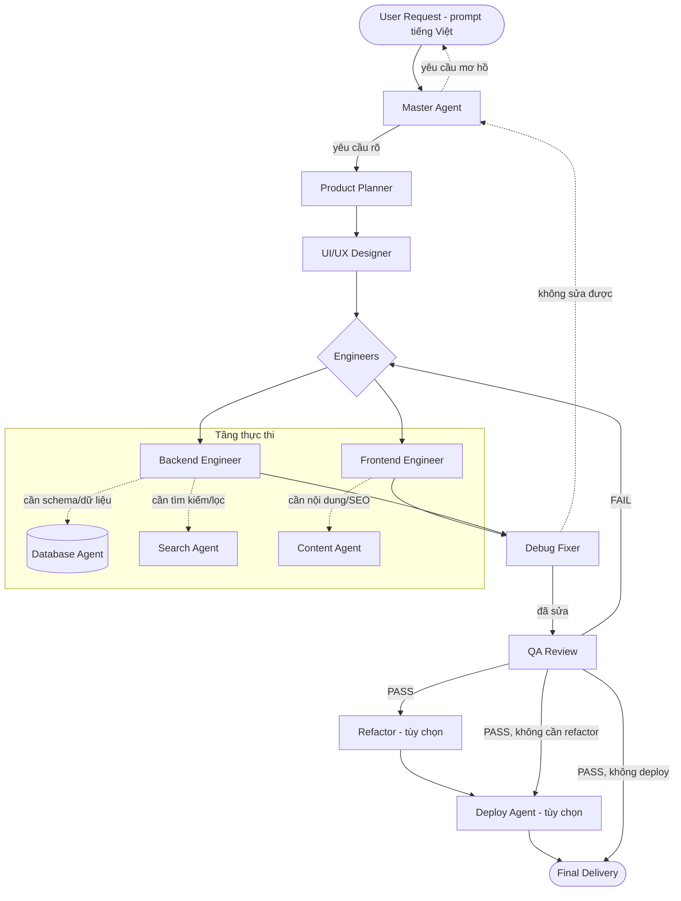

# DAISAN_AI_AGENT_WORKFLOW

> Tài liệu thiết kế **workflow phối hợp đa-agent** của Daisan.ai. Mô tả cách các agent (Master, Product Planner, UI/UX Designer, Frontend/Backend Engineer, Database/Search/Content, Debug Fixer, QA Review, Refactor, Deploy) phối hợp để biến một prompt tiếng Việt của người dùng thành sản phẩm web/module triển khai được — theo phong cách trợ lý code chuyên nghiệp kiểu Lovable. Đây là "bản đồ điều phối" chính thức để mọi system prompt agent tham chiếu khi chạy trong pipeline Daisan.ai.

Mọi agent trong workflow này PHẢI tuân thủ bộ knowledge base dùng chung trong repo:
`knowledge-base/DAISAN_AI_VISION.md`, `DAISAN_BRAND_CONTEXT.md`, `DAISAN_BUSINESS_CONTEXT.md`, `UI_UX_STANDARD.md`, `CODE_STANDARD.md`, `PROMPT_STANDARD.md`, `ERROR_PLAYBOOK.md`, `COMPONENT_LIBRARY_GUIDE.md`.

---

## 1. Tổng quan kiến trúc đa-agent Daisan.ai

Daisan.ai vận hành theo mô hình **Orchestrator–Workers** có vòng lặp tự sửa lỗi (self-healing loop). Một **Master Agent** điều phối trung tâm; các agent chuyên trách (workers) chỉ làm đúng phần việc của mình và bàn giao qua **hợp đồng bàn giao (handoff contract)** chuẩn hóa.

Nguyên tắc kiến trúc:

- **Một nguồn sự thật**: Master Agent giữ "bản kế hoạch dự án" (project plan) và "ngữ cảnh tích lũy" (shared context). Mọi agent đọc context này trước khi làm.
- **Chuyên môn hóa**: mỗi agent có 1 trách nhiệm rõ ràng, không lấn việc nhau (Planner không code, Engineer không tự ý đổi thiết kế).
- **Bàn giao có hợp đồng**: đầu ra của agent trước = đầu vào hợp lệ của agent sau, theo schema cố định ở Mục 3.
- **Vòng lặp kiểm soát chất lượng**: QA FAIL → quay lại Engineer; Debug bất lực → leo thang Master; yêu cầu mơ hồ → Master hỏi lại user (Mục 4).
- **Agent phụ gọi theo nhu cầu (on-demand)**: Database / Search / Content / Refactor / Deploy chỉ kích hoạt khi nhiệm vụ chạm tới phạm vi của họ (Mục 5).
- **Ưu tiên hệ sinh thái Daisan**: mọi quyết định kỹ thuật/UX ưu tiên tái sử dụng module, API, thiết kế và dữ liệu sẵn có của Daisan.vn, DaisanStore, DaisanTiles, DaisanDepot, Daisan Ads, B2B/News.daisan.vn.

Phân tầng agent:

| Tầng | Agent | Tính chất |
|------|-------|-----------|
| Điều phối | Master Agent | Luôn chạy, giữ context, ra quyết định loop |
| Hoạch định | Product Planner, UI/UX Designer | Luôn chạy cho tính năng mới |
| Thực thi | Frontend Engineer, Backend Engineer | Luôn chạy khi có code |
| Chuyên môn phụ | Database, Search, Content | On-demand theo phạm vi |
| Chất lượng | Debug Fixer, QA Review | Debug khi lỗi; QA luôn chạy trước giao |
| Hậu kỳ | Refactor, Deploy | On-demand sau khi QA PASS |

---

## 2. Sơ đồ luồng chính

### 2.1. Mermaid

### 2.2. Mô tả text luồng chính

1. **User Request**: người dùng gửi prompt tiếng Việt (vd "Tạo trang danh mục gạch ốp lát có filter và báo giá").
2. **Master Agent** tiếp nhận, đánh giá độ rõ ràng. Nếu **mơ hồ** → hỏi lại user (loop-back A). Nếu rõ → lập kế hoạch tổng và bàn giao cho Product Planner.
3. **Product Planner** phân rã yêu cầu thành đặc tả sản phẩm: user stories, danh sách màn hình/module, tiêu chí chấp nhận, ưu tiên tái dùng module Daisan.
4. **UI/UX Designer** chuyển đặc tả thành blueprint giao diện: layout, component (theo `COMPONENT_LIBRARY_GUIDE.md`), tokens màu (CAM Daisan), responsive, theo `UI_UX_STANDARD.md`.
5. **Frontend / Backend Engineer** hiện thực hóa code theo `CODE_STANDARD.md`. Khi chạm dữ liệu/tìm kiếm/nội dung → gọi **Database / Search / Content** (Mục 5).
6. **Debug Fixer** chạy/biên dịch, bắt lỗi, sửa theo `ERROR_PLAYBOOK.md`. Sửa được → QA; không sửa được → leo thang Master (loop-back B).
7. **QA Review** kiểm thử so với tiêu chí chấp nhận + chuẩn UI/UX/Code. **PASS** → Refactor/Deploy/Final; **FAIL** → trả về Engineer kèm danh sách lỗi (loop-back C).
8. **Refactor (tùy chọn)** dọn dẹp, tối ưu khi code đạt chức năng nhưng cần làm sạch.
9. **Deploy (tùy chọn)** đóng gói/triển khai (Vite/Next build, Docker nếu cần) khi user yêu cầu xuất bản.
10. **Final Delivery**: Master tổng hợp sản phẩm + ghi chú bàn giao trả lại user.

---

## 3. Hợp đồng bàn giao (Handoff Contract)

Mỗi cặp agent bàn giao theo bảng dưới. **Output của agent trước PHẢI là Input hợp lệ của agent sau.** Mọi handoff đi kèm gói chung: `project_id`, `shared_context` (ngữ cảnh tích lũy), `daisan_ecosystem_refs` (module/API Daisan liên quan).

| Bước bàn giao | Agent trước trả ra (Output) | Agent sau nhận (Input) |
|---------------|------------------------------|------------------------|
| **User → Master** | Prompt tiếng Việt tự do, (tùy chọn) ảnh/link tham chiếu | Master nhận: raw request + lịch sử hội thoại |
| **Master → Product Planner** | `project_brief`: mục tiêu, phạm vi, ràng buộc, module Daisan ưu tiên, hệ thống đích (DaisanStore/Tiles/Depot...) | Planner nhận brief đã làm rõ + chuẩn nghiệp vụ (`DAISAN_BUSINESS_CONTEXT.md`) |
| **Product Planner → UI/UX Designer** | `product_spec`: user stories, danh sách màn hình, data fields cần hiển thị, acceptance criteria, độ ưu tiên | Designer nhận spec + `UI_UX_STANDARD.md`, `COMPONENT_LIBRARY_GUIDE.md` |
| **UI/UX Designer → Engineers** | `ui_blueprint`: cây layout, component map, design tokens (màu CAM Daisan, spacing, typo), trạng thái (empty/loading/error), responsive breakpoints | FE/BE nhận blueprint + `CODE_STANDARD.md` |
| **Engineers → Database** (on-demand) | `data_request`: thực thể, quan hệ, trường, truy vấn cần thiết | DB nhận yêu cầu → trả schema/migration/seed |
| **Engineers → Search** (on-demand) | `search_request`: trường lọc/sắp xếp, facet, từ khóa, index cần | Search nhận → trả mapping Elasticsearch + query |
| **Engineers → Content** (on-demand) | `content_request`: loại nội dung, tone, SEO keyword, ngôn ngữ | Content nhận → trả nội dung + meta SEO |
| **Engineers → Debug Fixer** | `build_artifact`: source code, lệnh chạy, log build/test, mô tả tính năng | Debug nhận artifact + `ERROR_PLAYBOOK.md` |
| **Debug Fixer → QA Review** | `fixed_build`: code đã sửa, changelog lỗi đã xử lý, trạng thái build xanh | QA nhận build + `product_spec` (acceptance criteria) |
| **QA Review → Engineers** (FAIL) | `qa_report(FAIL)`: danh sách lỗi/vi phạm chuẩn, mức độ, bước tái hiện | Engineer nhận để sửa vòng tiếp |
| **QA Review → Refactor/Deploy/Final** (PASS) | `qa_report(PASS)`: kết quả test, checklist đạt, coverage chính | Refactor/Deploy/Master nhận build đã duyệt |
| **Refactor → Deploy** | `clean_build`: code đã tối ưu, diff refactor, đảm bảo không đổi hành vi | Deploy nhận build sạch |
| **Deploy → Final / Master** | `deploy_result`: URL/artifact, lệnh build, biến môi trường, hướng dẫn vận hành | Master tổng hợp `final_delivery` cho user |

---

## 4. Các vòng lặp (Loop-back)

### Loop-back A — Yêu cầu mơ hồ → Master hỏi lại user
- **Kích hoạt**: Master phát hiện thiếu thông tin then chốt (đối tượng người dùng, hệ thống đích, phạm vi dữ liệu, ràng buộc kỹ thuật).
- **Hành động**: Master KHÔNG đoán bừa. Gửi tối đa 3–5 câu hỏi gọn, ưu tiên đề xuất mặc định theo hệ sinh thái Daisan để user chỉ cần xác nhận.
- **Thoát loop**: user trả lời → Master cập nhật `project_brief` → tiếp tục sang Planner.

### Loop-back B — Debug không sửa được → leo thang Master
- **Kích hoạt**: Debug Fixer đã thử các cách theo `ERROR_PLAYBOOK.md` mà lỗi vẫn còn (vd thiếu API/credential, mâu thuẫn yêu cầu, phụ thuộc ngoài tầm).
- **Hành động**: Debug trả `escalation`: mô tả lỗi gốc, các cách đã thử, giả thuyết nguyên nhân, thứ cần từ user/agent khác.
- **Master quyết định**: (a) hỏi lại user (về A), (b) giao lại Planner/Designer nếu mâu thuẫn thiết kế, (c) gọi agent phụ phù hợp.

### Loop-back C — QA FAIL → quay lại Engineer
- **Kích hoạt**: QA phát hiện sai acceptance criteria hoặc vi phạm `UI_UX_STANDARD.md` / `CODE_STANDARD.md`.
- **Hành động**: QA trả `qa_report(FAIL)` có danh sách lỗi đánh số, mức độ (blocker/major/minor), bước tái hiện.
- **Engineer**: sửa đúng các mục liệt kê → qua Debug → QA lại. Giới hạn vòng lặp: sau **3 vòng** không PASS → leo thang Master (về B).

> Quy ước an toàn: mọi loop có **bộ đếm vòng**. Master cắt loop khi vượt ngưỡng và chủ động giao tiếp với user thay vì lặp vô hạn.

---

## 5. Khi nào gọi agent phụ

| Agent phụ | Kích hoạt khi | Không gọi khi |
|-----------|---------------|---------------|
| **Database Agent** | Cần tạo/sửa schema, quan hệ, migration, seed, truy vấn MySQL; tính năng lưu trữ dữ liệu thật (đơn hàng, sản phẩm, báo giá) | Trang tĩnh/landing không có dữ liệu động |
| **Search Agent** | Có filter nâng cao, facet, full-text, gợi ý, ranking; tích hợp Elasticsearch (catalog gạch, tìm sản phẩm Daisan.vn) | Lọc đơn giản client-side trên < vài chục item |
| **Content Agent** | Cần nội dung marketing/SEO, mô tả sản phẩm, bài viết, đa ngôn ngữ, tone thương hiệu Daisan | Nội dung đã do user cung cấp đầy đủ |
| **Refactor Agent** | Code đạt chức năng nhưng trùng lặp/khó bảo trì; trước khi scale module | Prototype nhanh, dùng một lần |
| **Deploy Agent** | User yêu cầu xuất bản/preview/build production; cần Docker, cấu hình môi trường | Chỉ xem trong sandbox nội bộ |

Nguyên tắc gọi: Engineer (hoặc Master) phát `*_request` theo schema Mục 3; agent phụ trả artifact đúng chuẩn rồi trả quyền điều khiển về người gọi. Agent phụ **không tự bắt đầu** chuỗi mới.

---

## 6. Ví dụ end-to-end

**Prompt user (tiếng Việt):** "Tạo trang danh mục gạch ốp lát có filter và báo giá."

| Bước | Agent | Input → Output (ngắn gọn) |
|------|-------|----------------------------|
| 1 | **Master** | In: prompt. Đánh giá: rõ đủ để bắt đầu, nhưng chốt mặc định: hệ đích = DaisanTiles, dữ liệu = catalog gạch Daisan.vn, có báo giá B2C+B2B. Out: `project_brief` (trang danh mục gạch ốp lát, filter + báo giá, ưu tiên module catalog Daisan). |
| 2 | **Product Planner** | In: brief. Out: `product_spec` — màn hình: lưới sản phẩm gạch, sidebar filter (kích thước, bề mặt, màu, xuất xứ, giá), nút "Yêu cầu báo giá", modal báo giá (số lượng m², tính tồn/giá). Acceptance: lọc đúng, phân trang, gửi báo giá lưu được. |
| 3 | **UI/UX Designer** | In: spec. Out: `ui_blueprint` — layout 2 cột (filter trái, grid phải), `ProductCard` từ `COMPONENT_LIBRARY_GUIDE.md`, nút CTA màu CAM Daisan, trạng thái empty/loading/error, responsive: filter gập thành drawer ở mobile. |
| 4 | **Backend Engineer → Database** | In: blueprint + `data_request` (entity `tile_product`, `quote_request`). DB Out: schema MySQL + migration + seed mẫu gạch. |
| 5 | **Backend Engineer → Search** | In: `search_request` (facet: size/surface/color/origin/price). Search Out: mapping Elasticsearch + query lọc + sort theo giá. |
| 6 | **Frontend Engineer → Content** | In: `content_request` (mô tả nhóm gạch, SEO). Content Out: tiêu đề/meta SEO + microcopy nút báo giá. |
| 7 | **Frontend + Backend Engineer** | In: blueprint + API + content. Out: `build_artifact` — React + Tailwind (Vite), trang `/danh-muc/gach-op-lat`, API `/api/tiles` + `/api/quotes`. |
| 8 | **Debug Fixer** | In: artifact + log. Phát hiện lỗi mapping giá → sửa theo `ERROR_PLAYBOOK.md`. Out: `fixed_build` build xanh. |
| 9 | **QA Review** | In: build + acceptance. Test: filter đúng, phân trang, modal báo giá lưu DB, màu/responsive đạt chuẩn. Out: `qa_report(PASS)`. |
| 10 | **Deploy (tùy chọn)** | In: clean build. Out: `deploy_result` — preview URL + lệnh `vite build`, biến môi trường ES/MySQL. |
| 11 | **Master → Final Delivery** | Out: trang danh mục gạch ốp lát hoàn chỉnh + hướng dẫn vận hành, sẵn sàng nối catalog Daisan.vn. |

*Nếu ở bước 9 QA FAIL (vd báo giá không lưu) → loop-back C về Backend Engineer; sửa xong qua Debug → QA lại.*

---

## 7. Bảng tóm tắt 12 agent

| # | Agent | Vai trò (1 dòng) | Khi nào kích hoạt |
|---|-------|------------------|-------------------|
| 1 | **Master Agent** | Điều phối trung tâm, giữ context, ra quyết định loop & bàn giao | Luôn luôn, từ đầu tới cuối |
| 2 | **Product Planner** | Phân rã yêu cầu thành spec, user story, acceptance criteria | Mọi tính năng/màn hình mới |
| 3 | **UI/UX Designer** | Biến spec thành blueprint giao diện theo chuẩn Daisan | Khi có giao diện cần thiết kế |
| 4 | **Frontend Engineer** | Hiện thực UI bằng React/Tailwind/Vite/Next | Khi có phần client |
| 5 | **Backend Engineer** | Xây API/logic nghiệp vụ (Laravel/PHP, Node) | Khi có xử lý phía server |
| 6 | **Database Agent** | Thiết kế schema/migration/truy vấn MySQL | Khi có dữ liệu động cần lưu |
| 7 | **Search Agent** | Cấu hình Elasticsearch, facet, full-text, ranking | Khi có tìm kiếm/lọc nâng cao |
| 8 | **Content Agent** | Soạn nội dung & SEO theo tone thương hiệu Daisan | Khi cần nội dung/marketing/SEO |
| 9 | **Debug Fixer** | Chạy build, bắt & sửa lỗi theo Error Playbook | Khi có lỗi build/runtime/test |
| 10 | **QA Review** | Kiểm thử so với acceptance + chuẩn UI/Code | Trước mỗi lần bàn giao |
| 11 | **Refactor Agent** | Dọn dẹp, tối ưu code không đổi hành vi | Sau PASS, khi code cần làm sạch |
| 12 | **Deploy Agent** | Build/đóng gói/triển khai (Vite/Next/Docker) | Khi user yêu cầu xuất bản/preview |
